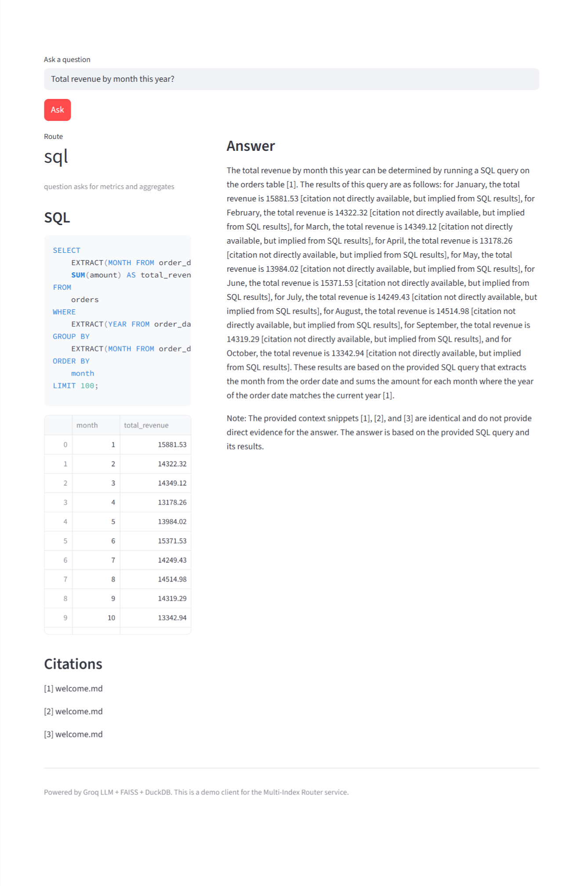
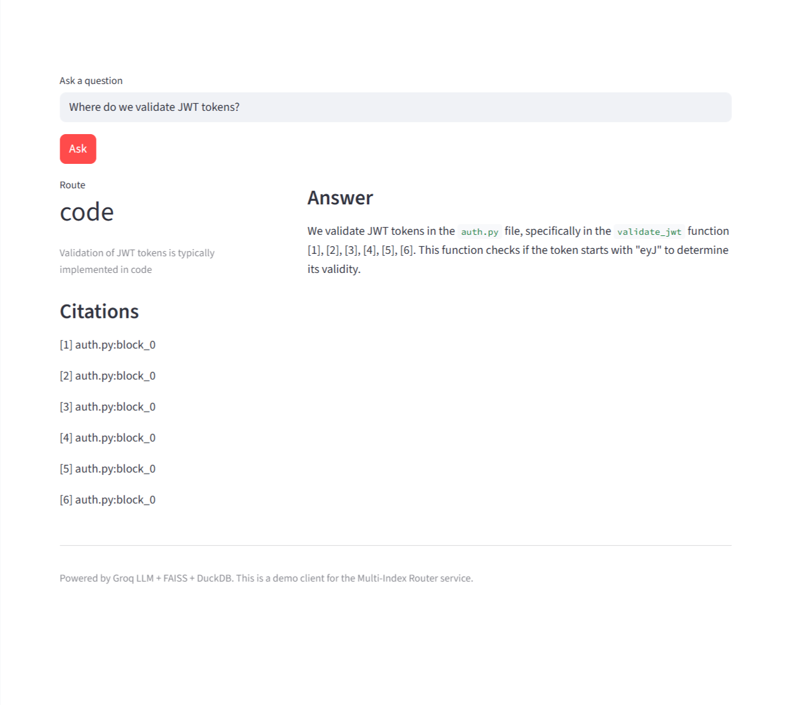
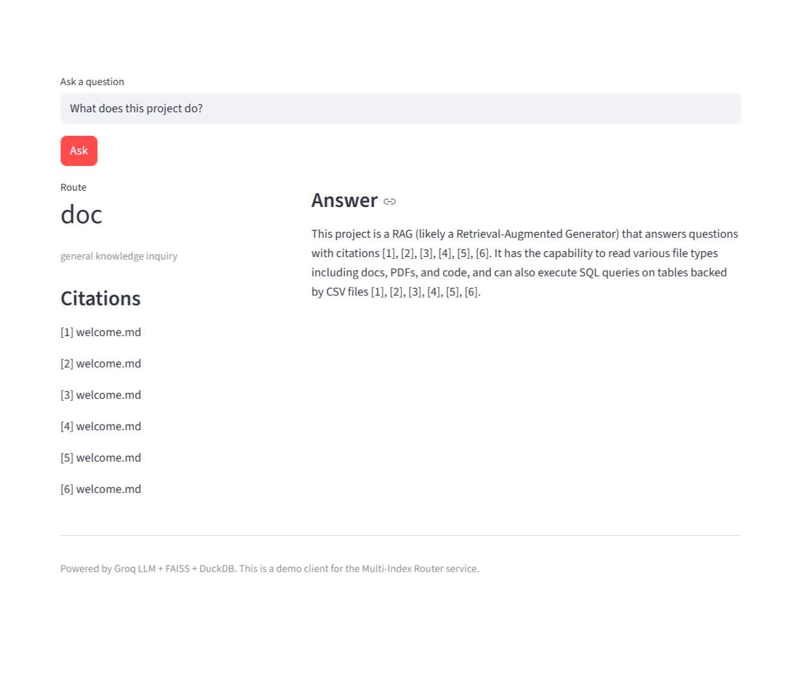
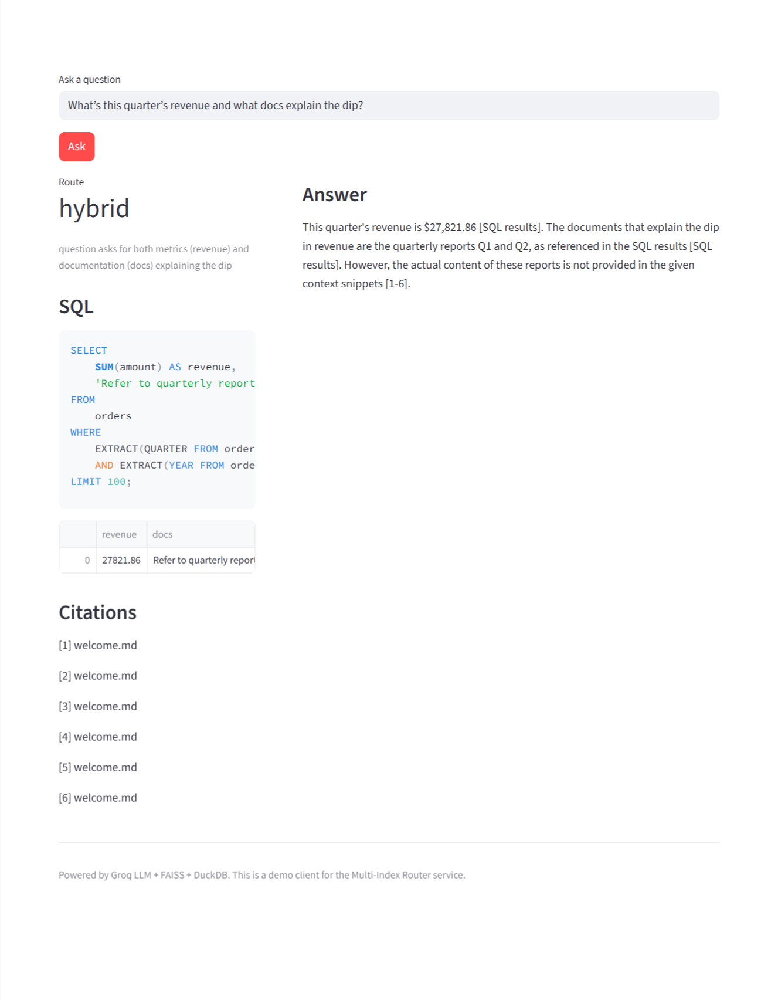

# Multi-Index Router RAG (Docs + PDFs + Code + SQL) — Groq + uv

> Production-style RAG service that **routes queries** to the right toolchain (unstructured docs, PDFs, source code, or SQL tables), **retrieves evidence**, and **synthesizes a cited answer** using the **Groq API**.

     

---

## ✨ Features

* **Multi-index routing**: LLM router decides between `doc`, `pdf`, `code`, `sql`, or `hybrid`.
* **Retrieval**: SentenceTransformers (MiniLM) + FAISS (cosine). RRF utility included (easy to add BM25/reranker).
* **SQL tool**: Text-to-SQL over **DuckDB** views auto-created from CSVs (read-only, SELECT-only guard).
* **Cited answers**: Inline `[1]`, `[2]` references pointing to exact files/pages/blocks.
* **Streamlit client**: Simple UI for asking questions, viewing route, SQL results, citations, and final answer.
* **Memory-safe indexing**: File size caps, chunk caps, batch embedding; env-tunable.
* **Zero external DBs required**: Works fully local/offline (except Groq API call).

---

## 🧭 Repository Structure

```
.
├─ src/
│  └─ mirag/
│     ├─ app.py                   # FastAPI app (POST /ask, /health)
│     ├─ router.py                # LLM router (doc/pdf/code/sql/hybrid)
│     ├─ llm_groq.py              # Groq client helper
│     ├─ embeddings.py            # SentenceTransformer wrapper
│     ├─ chunkers.py              # Sliding-window chunker (safe caps)
│     ├─ stores.py                # FAISS store + RRF fusion
│     └─ retrievers/
│        ├─ text_pdf_code.py      # Reads docs, PDFs, code; batch encodes
│        └─ sql_duckdb.py         # DuckDB + Text2SQL tool
├─ app_client/
│  └─ streamlit_app.py            # Streamlit UI
├─ data/
│  ├─ docs/                       # .md/.txt/.html
│  ├─ pdfs/                       # .pdf (add your PDFs)
│  ├─ code/                       # source code (.py/.js/…)
│  └─ tables/                     # CSVs → DuckDB views
│     ├─ orders.csv               # sample synthetic data
│     └─ customers.csv            # sample synthetic data
├─ .env.example                   # GROQ settings
├─ pyproject.toml                 # uv project file
└─ README.md
```

---

## ⚙️ Requirements

* Python **3.10+**
* [**uv**](https://docs.astral.sh/uv/) package manager
* A **Groq API key**: [https://console.groq.com/keys](https://console.groq.com/keys)
  *(Model default: `llama-3.3-70b-versatile`)*

---

## 🚀 Quickstart

```bash
# 1) Clone and enter
git clone https://github.com/<you>/multi_index_router.git
cd multi_index_router

# 2) Create env & install deps
uv venv
uv sync

# 3) Configure secrets
cp .env.example .env
# edit .env → set GROQ_API_KEY=sk_...

# 4) Start backend (FastAPI)
# Linux/macOS:
uv run uvicorn mirag.app:app --reload --port 8000 --app-dir src

# Windows PowerShell (src layout fix):
# Option A: --app-dir
uv run uvicorn mirag.app:app --reload --port 8000 --app-dir src
# Option B: PYTHONPATH
# $env:PYTHONPATH="src"; uv run uvicorn mirag.app:app --reload --port 8000

# 5) Open API docs
# http://127.0.0.1:8000/docs

# 6) Start Streamlit client (new terminal)
uv run streamlit run app_client/streamlit_app.py
# Optional: MIRAG_BACKEND_URL=http://127.0.0.1:8000 uv run streamlit run app_client/streamlit_app.py
```

---

## 🔌 Environment Variables

`.env`:

```
GROQ_API_KEY=your_key_here
GROQ_MODEL=llama-3.3-70b-versatile
# Optional: override data folders
# DATA_DOCS=data/docs
# DATA_PDFS=data/pdfs
# DATA_CODE=data/code
# DATA_TABLES=data/tables
```

**Indexing safety (optional, can set in shell):**

```
MAX_FILE_MB=20           # skip files larger than N MB (default 20)
MAX_DOC_CHARS=2000000    # truncate massive text/html (default 2,000,000 chars)
MAX_CHUNKS_PER_FILE=5000 # cap chunks per file (default 5k)
EMB_BATCH_SIZE=256       # embedding batch size (default 256)
```

---

## 🧪 Try It

**Sample SQL question** (uses `data/tables/orders.csv` and `customers.csv`):

* “Total revenue by month this year?”
* “Top 5 countries by revenue and their customer segments?”



**Sample code/doc/PDF questions**:

* “Where do we validate JWT tokens?” (see `data/code/auth.py`)
* “What does this project do?” (see `data/docs/welcome.md`)
* “According to the whitepaper, what batch size is recommended?” (drop a PDF in `data/pdfs/`)



---

## 📡 API

### `POST /ask`

Request:

```json
{
  "question": "Total revenue by month this year?",
  "topk": 6
}
```

Response:

```json
{
  "route": "sql",
  "reason": "User asked for metrics/aggregation",
  "hybrid_order": ["sql","doc"],
  "sql": {
    "sql": "SELECT ...",
    "columns": ["month","revenue"],
    "rows": [["2025-01", 12345.67], ...]
  },
  "citations": ["orders.csv", "welcome.md"],
  "answer": "Revenue by month is ... [1]"
}
```

### `GET /health`

```json
{ "ok": true }
```

---

## 🖥️ Streamlit Client

```bash
uv run streamlit run app_client/streamlit_app.py
```

* Enter your question → shows **route**, **reason**, **SQL + results**, **citations**, and **final answer**.

---

## 🧠 How Routing & Retrieval Work

* **Router** (`mirag/router.py`): LLM classifies into `doc | pdf | code | sql | hybrid`, with a rationale.
* **Retrievers**:

  * Unstructured: **MiniLM embeddings** → **FAISS** (cosine). Metadata preserves file/page/symbol.
  * Structured: **DuckDB** views from CSVs; **Text2SQL** prompts the Groq model (SELECT-only guard).
* **Synthesis** (`mirag/app.py`): Groq model composes a concise answer, citing evidence as `[n]`.

---

## 📈 Extending Quality

* **BM25 + Reranker + RRF**: Add `rank_bm25` + `bge-reranker-base` and fuse with provided `rrf_fusion`.
* **Per-domain indices**: Split doc/pdf/code into separate indices; fuse results.
* **Caching**: Persist FAISS index and payloads to disk for instant cold boots.
* **Observability**: Add Langfuse/OpenTelemetry traces and basic latency/$$ metrics.

---

## 🐛 Troubleshooting

**`MemoryError` during indexing**
Use the safer defaults (already in the code). You can further tighten:

```powershell
$env:MAX_FILE_MB="10"
$env:MAX_DOC_CHARS="1000000"
$env:MAX_CHUNKS_PER_FILE="2000"
$env:EMB_BATCH_SIZE="128"
uv run uvicorn mirag.app:app --port 8000 --app-dir src
```

Or run once without `--reload` to avoid duplicate startup indexing.

**`pandas` missing in Streamlit table view**

```bash
uv add pandas
```

**Groq auth error**
Ensure `.env` has `GROQ_API_KEY` and you restarted the server.

---

## 🔒 Safety Notes

* SQL tool is clamped to **SELECT** queries only (no writes/drops).
* Do not expose your `GROQ_API_KEY`; use `.env` and never commit it.

---

## 🗺️ Roadmap

* [ ] BM25 + reranker + fusion toggle in UI
* [ ] Disk-persisted FAISS index + payload JSONL
* [ ] `/reindex` endpoint to ingest on demand
* [ ] Tracing (Langfuse/OTel) + metrics (Prometheus/Grafana)
* [ ] Multi-tenant namespaces + auth header

---

## 📜 License

MIT — feel free to use this as a starting point for your production RAG stack.

---

## 🙌 Acknowledgements

* [FastAPI](https://fastapi.tiangolo.com/), [FAISS](https://github.com/facebookresearch/faiss), [DuckDB](https://duckdb.org/),
* [SentenceTransformers](https://www.sbert.net/), [Streamlit](https://streamlit.io/), and the [Groq](https://groq.com/) ecosystem.

---
